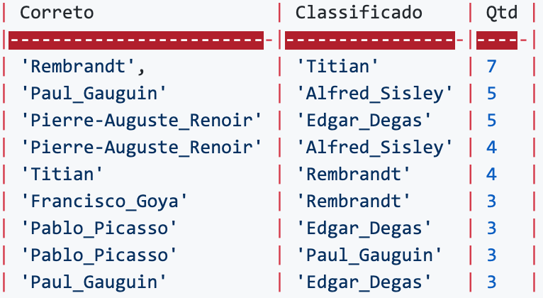

**Introdução**
=============
Dentre as diversas ferramentas e estudos que compreendem os estudos de Ciências de Dados, temos o estudo de deep learning (aprendizagem de máquina) baseado em um conjunto de algoritmos que tentam modelar abstrações de dados em alto nível, afim de criar modelos que possam vir a criar padrões de classificações para a gama de dados.

A pintura acompanha a humanidade desde os primórdios, cerca de 40.000 anos A.C, sendo marcado como o início da pré-escrita. A pintura tem seu grande ápice desde o período medieval, até o séculos XX. Neste tempo tendo grandes autores, como Leonardo Da Vinci, Michelangelo, Vincent Van Gogh entre outros.

Neste contexto, de vários pintores e obras, cada pintor marcou-se por traços e técnicas para realizarem suas pinturas, sendo de grande dificuldade para pessoas que não compreendem muitas vezes a arte a diferenciarem as obras realizadas. Tendo em vista este desafio, este trabalho procurou identificar e criar padrões que possam identificar cada obra para cada devido artista. Juntamente com as técnicas de classificação obtidos nos estudos de deep learning este trabalho visa proporcionar a classificação de cada imagem das obras dos autores para que possamos identificar a quem pertence, deixando assim um estudo de compreensão da arte mais tangível para quem não está familiarizado.

Assim nas próximas etapas, iremos demonstrar as etapas que o trabalho nos levou para a descoberta de modelos de classificação.

**Modelo**
================
Para a execução do trabalho, foi utilizado a rede Resnet34 sendo testada em algumas épocas diferentes afim de verificar a acuracidade dos valores obtidos. Além da Resnet34, foi realizado testes com a rede SqueezeNet01 nos mesmos formatos para a classificação das imagens conforme proposto pelo trabalho. 

Com estas informações, começamos a realizar os treinamentos para a classificação das imagens, sendo primeiramente realizado testes na Resnet34. Na Figura 1, pode ser observado a sua arquitetura.

**Figura 1 - Rede Resnet34**

Após a realização de testes junto a Resnet34, foram realizados testes com a SqueezeNet01, utilizando o mesmo conjunto de dados, para que fosse possível realizar um comparativo entre as classificações obtidas. A su arquitetura pode ser vista na Figura 2.

**Figura 2 - Rede SqueezeNet01**

**Execução**
============
Para a execução do trabalho, foi utilizado a rede Resnet34 com 4 épocas de execução, além de 2629 imagens de artistas propostos para a classificação das mesmas. 
Com estas informações, começamos a realizar os treinamentos para a classificação das imagens. Em primeiro momento, realizamos a divisão do dataset para darmos início ao treino como pode ser visto na Figura 3.

**Figura 3 - Divisão do Dataset**

Com essa divisão do Dataset para o treino, foi obtido uma base de treinamento de 2104 imagens
e 525 imagens para a validações mesmos, sendo que estes foram gerados 11 classes de artistas com a seguinte classificação:

Classes: Albrecht_Dürer, Alfred_Sisley, Edgar_Degas, Francisco_Goya, Marc_Chagall, Pablo_Picasso, Paul_Gauguin, Pierre-Auguste_Renoir, Rembrandt, Titian,Vincent_van_Gogh

Após a realização da divisão do Dataset, foi iniciado por sua vez a execução do treinamento junto a Resnet34, para que pudesse ser verificado em 4 épocas inicialmente seus valores. Nesta primeira execução tivemos os seguintes resultados conforme pode ser visto na Tabela 1:

**Tabela 1 - Demonstrativo de Execução de 4 Épocas**

Com 4 épocas tivemos uma acurácia de 77,33%, e pode se verificar que houveram alguns erros na validação, com destaque para imagens que eram de Rembrandt, mas foram classificados erroneamente como Titian (7 casos), estes podendo serem vistos na Tabela 2.

**Tabela 2 - Comparativo de Acertos após execução**

Para a próxima execução, foi utilizado a quantidade de 10 épocas para verificar se os valores teriam um ganho significativo, ou se teríamos uma perda de rendimento nos resultados encontrados. Para estes resultados, podemos ver na Tabela 3.

**Tabela 3 - Demonstrativo de Execução de 10 Épocas**

Com 10 épocas tobtivemos uma acurácia de 81,52%. Nesta execução foi possível ver que o número de artistas que com erros diminuiu, porém a incidência sobre os mesmos persiste, como pode ser observado na Tabela 4.

**Tabela 4 - Comparativo de Acertos após execução**

Por fim, utilizamos a execução da Rede SqueezeNet 1.0 com a inclusão de 8 épocas para realizar o comparativo da classificação de ambas as redes. Esta execução resultou em uma acuracia de 78,85% na classificação das imagens junto aos seus verdadeiros pintores. Este resultado pode ser visto na tabela 5.

**Tabela 5 - Demonstrativo de Execução de 8 Épocas**

Conclusão
============
The conclusion goes here.

Referências
===================

Here are two sample references: @Feynman1963118 [@Dirac1953888].

\newpage
Referências {#references .numbered}
==========
